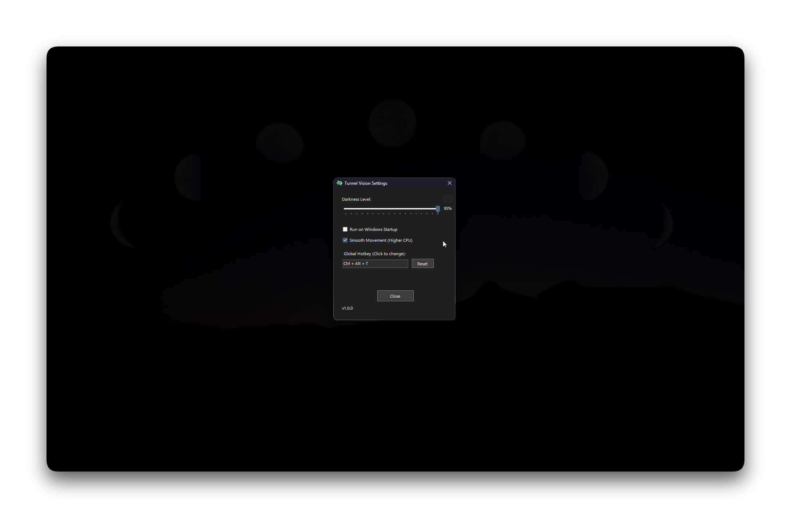

  

  

## Tunnel Vision

A lightweight focus tool that dims the screen while highlighting the currently active window, helping you reduce distractions and stay focused.

  

- Tray menu adapts to Dark/Light Windows theme
- Global hotkey to toggle focus (default: Ctrl+Alt+T)
- In-app GitHub icon to open the repository instantly
- Automatic update check against GitHub Releases with a prompt when a new version is available

### Download

- Get the latest release: https://github.com/voidksa/TunnelVision/releases/latest

### Installation

- Download TunnelVision.zip from the Releases page
- Extract the ZIP to any folder (e.g., Desktop or Documents)
- Run TunnelVision.exe directly — no installation required

### Usage

- After extraction, run TunnelVision.exe (portable)
- From the system tray: open settings, toggle focus, or exit the app

### Contributing

Contributions are welcome! Please open an issue or submit a pull request.
