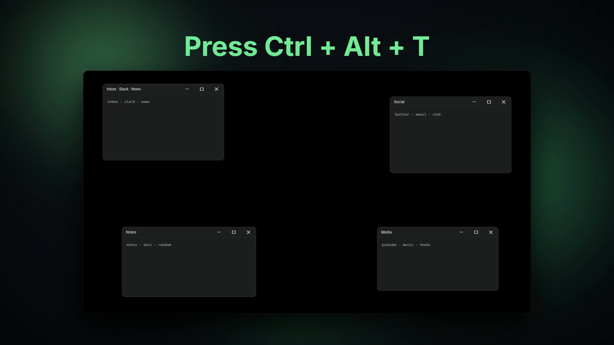
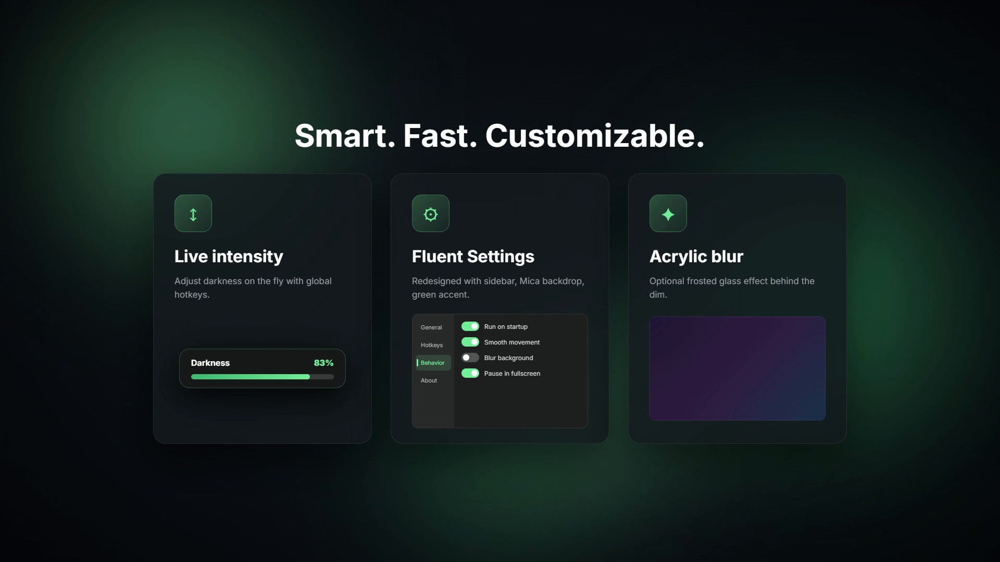

<div align="center">
  
  <h1>Tunnel Vision</h1>
  <p><strong>Focus on what matters. Dim the rest.</strong></p>

  [](https://github.com/voidksa/TunnelVision/releases/latest)
  [](https://github.com/voidksa/TunnelVision/releases)
  [](LICENSE)
  [](https://www.microsoft.com/windows)
  [](https://dotnet.microsoft.com/)
</div>

<br />

<p align="center">
  <b>Tunnel Vision</b> is a lightweight, portable Windows utility that cuts through visual noise.
  It automatically dims everything on your screen except the active window — keeping you locked in
  on what actually matters while you work, write, code, or game.
</p>

<p align="center">
  <a href="https://github.com/voidksa/TunnelVision/releases/latest">
    
  </a>
</p>

---

## 🎬 See it in action

https://github.com/voidksa/TunnelVision/releases/latest/download/demo.mp4

> If the video does not autoplay, [click here to watch on the latest release page](https://github.com/voidksa/TunnelVision/releases/latest).

<table>
  <tr>
    <td></td>
    <td></td>
  </tr>
  <tr>
    <td align="center"><b>Everything fades. Your focus window glows.</b></td>
    <td align="center"><b>Live intensity · Fluent Settings · Custom tint</b></td>
  </tr>
</table>

---

## ✨ What's New in v1.1.0

### Intensity control on the fly
Stop digging through settings every time your lighting changes. Press `Ctrl + Alt + ↑` or `Ctrl + Alt + ↓` to nudge the darkness level right now — a slick green on-screen indicator pops up to show where you are.

- 🟩 **On-screen indicator (OSD)** — appears briefly near the bottom of your screen, fades out automatically.
- 🎚️ **Customizable step size** — change the jump per keypress between 1% and 25% (Settings → General → Step size).

### Fluent Settings window, redesigned from scratch
Tabs are out, Win11 sidebar navigation is in. Mica backdrop. Custom-drawn sliders, toggle switches, numeric inputs, buttons — every control matches the new green accent.

- 🪟 **Mica backdrop** on Windows 11 (falls back to solid dark/light on Windows 10).
- 🎛️ **Sidebar navigation** with an accent bar indicator on the active page.
- 🔘 **Custom ToggleSwitch / ModernSlider / ModernNumericInput / ColorSwatch** controls — no more system gray rectangles.
- 🌓 **Full dark/light theme support** tracking Windows system theme.

### New shortcuts
| Action | Shortcut |
| :--- | :---: |
| Toggle focus on/off | `Ctrl` + `Alt` + `T` |
| **Increase intensity** | `Ctrl` + `Alt` + `↑` |
| **Decrease intensity** | `Ctrl` + `Alt` + `↓` |
| **Open / close Settings** | `Ctrl` + `Alt` + `S` |

All four shortcuts are **fully rebindable** under Settings → Hotkeys, with conflict detection to prevent collisions between actions.

### Dim color picker
Pure black not your vibe? Pick any tint (deep navy, warm brown, dark green...) and Tunnel Vision uses that as the dim color. Default stays pure black for maximum contrast.

### Auto-pause in fullscreen
Games, videos, and presentations now get a pass — the overlay detects when a window covers the whole screen and hides itself automatically. Toggle in Settings → Behavior.

### Smarter update system
- 🔔 **Native balloon notifications** in the tray when a new version ships.
- 📋 **Changelog preview** — see exactly what changed before you download.
- ⏭️ **Skip this version** — if you don't want the prompt again for a specific release.
- 🔄 **Manual check** from Settings → About → Check for updates.
- 🟢 **Tray pulse** — an update-available item appears prominently in the tray menu.

### Fluent tray menu
Right-click the tray icon and you get a proper Windows 11 context menu — native rounded corners (DWM), dark/light theme aware, proper padding, subtle hover states. No more system-gray square menu.

### Stability & polish
- 🛡️ **Global exception handler** catches crashes and writes them to `crash.log` next to the executable, so bugs are easy to report.
- 🧹 Fixed a rare "Collection was modified" crash when clicking Exit while the tray menu was open.
- 🧹 Fixed a NullReference crash when opening Settings on first launch.
- ⚡ Settings window now opens and resizes instantly — all controls use proper transparency.

> 🔮 **Coming later:** blur / acrylic backdrop. The groundwork is in place, but Windows' acrylic API conflicts with our region-based focus cutout (the acrylic fills over the focus window). A proper implementation using a separate blur window with masking is in the backlog.

---

## 🎯 Core Features

| | |
|---|---|
| 🎯 | **Smart Focus** — automatically highlights the active window and dims the background. |
| 🌓 | **Theme Aware** — adapts to Windows Light / Dark mode in real time. |
| 📦 | **Portable** — single `.exe`, no installer, no admin rights. |
| ⚡ | **Lightweight** — optimized region updates keep CPU use near zero when idle. |
| 🔄 | **Auto-Updates** — background check every 6 hours, with opt-out. |
| ⌨️ | **Global Hotkeys** — control everything without touching the mouse. |
| 🎨 | **Customizable** — tint color, darkness level, step size, all hotkeys. |
| 🪟 | **Win11 Native Feel** — Mica backdrop, Fluent controls, rounded corners. |

---

## 📥 Download & Install

1. Go to the [Releases Page](https://github.com/voidksa/TunnelVision/releases/latest).
2. Download **`TunnelVision-v1.1.0.zip`**.
3. Extract anywhere (Documents, Desktop, USB drive...).
4. Run `TunnelVision.exe`.

> Requires [.NET Desktop Runtime 8.0](https://dotnet.microsoft.com/en-us/download/dotnet/8.0). Windows will prompt you if it's missing.

---

## 🎮 Usage

Tunnel Vision lives quietly in your System Tray. Right-click the icon for the full menu.

### Tray menu
- **Pause / Resume** — toggle the overlay without closing.
- **Increase / Decrease intensity** — same as the hotkeys.
- **Settings…** — open the configuration window.
- **Check for updates** — manually poll GitHub for a new release.
- **GitHub** — project page.
- **Exit** — fully quit.

### First-run experience
The app shows a tray notification with the default shortcuts the first time you launch it. After upgrading to a new version, you get a short "what's new" toast so you know what to try.

---

## ⚙️ Settings Overview

| Tab | What you can do |
| :--- | :--- |
| **General** | Darkness level (10–95%), step size (1–25%), on-screen indicator toggle, dim color picker. |
| **Hotkeys** | Rebind any of the four shortcuts; press the combo in the field. Built-in conflict detection. |
| **Behavior** | Run on Windows startup, smooth tracking (~60 FPS), auto-pause in fullscreen, auto-update toggle. |
| **About** | Version, manual update check, GitHub link, report-an-issue link. |

---

## 🛠️ Built With

- **[C# / .NET 8](https://dotnet.microsoft.com/)** — core logic and runtime
- **[Windows Forms](https://docs.microsoft.com/en-us/dotnet/desktop/winforms/)** — UI and tray integration
- **[DWM + User32 P/Invoke](https://www.pinvoke.net/)** — window tracking, global hotkeys, Mica backdrop, rounded corners, custom composition effects

---

## 🏗️ Build from Source

```bash
git clone https://github.com/voidksa/TunnelVision.git
cd TunnelVision
dotnet publish -c Release -r win-x64 --self-contained false -p:PublishSingleFile=true
```

The built executable will be at `bin/Release/net8.0-windows/win-x64/publish/TunnelVision.exe`.

---

## 📋 Changelog

### v1.1.0 — April 2026
- Intensity hotkeys + step size + OSD indicator
- Settings hotkey (`Ctrl+Alt+S`)
- Dim color picker with tint preview
- Auto-pause in fullscreen
- Redesigned Settings (sidebar, Mica, Fluent controls, green accent)
- Fluent tray menu with Win11 rounded corners
- Smarter update system (changelog, skip version, manual check, balloon tips)
- Global exception handler → `crash.log`
- Bug fixes: Settings crash on first open, menu-item exit crash

### v1.0.0 — March 2026
- Initial release: dim-everything-except-active-window overlay
- Single toggle hotkey (Ctrl+Alt+T)
- Basic darkness level slider
- Background update checker

---

## 🐛 Bugs & Ideas

Open an issue on [GitHub Issues](https://github.com/voidksa/TunnelVision/issues). Pull requests welcome.

If the app crashes, grab `crash.log` from next to the executable and attach it to your report.

---

## 📄 License

MIT — see [LICENSE](LICENSE).

---
<p align="center">
  Made with ♥ by <a href="https://github.com/voidksa">voidksa</a>
</p>
